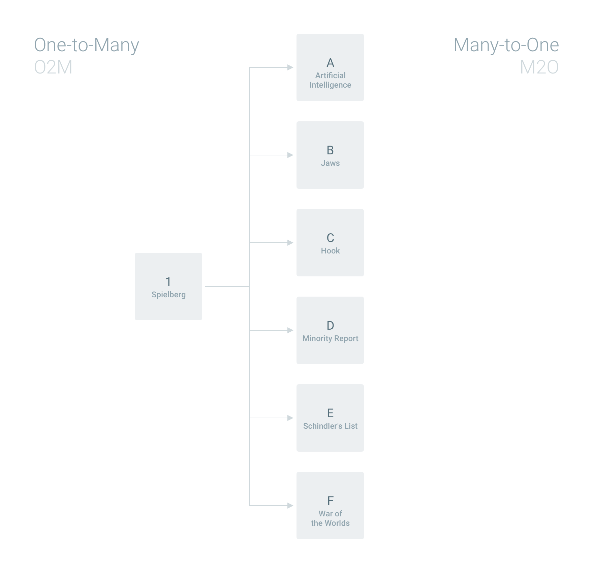
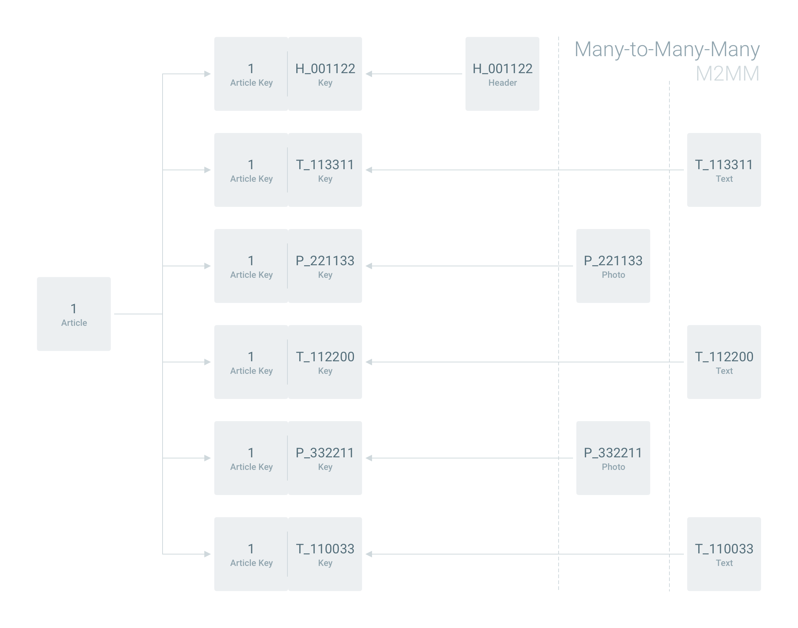

#### Relationships

##### One-to-Many

In relational databases, a one-to-many (O2M) relationship exists when an item of **Collection A** may be linked to many items of **Collection B**, but an item of **Collection B** is linked to only one item of **Collection A**. For example, directors have many movies, but a movie only has one director.

Now let's translate this to Directus interfaces. The `directors` collection could have a multi-select listing of every movie (a O2M interface). However you could also view at this relationship in the opposite direction as a many-to-one (M2O), which would be a dropdown of directors on the `movies` collection. So a O2M relationship is also a M2O (and vice versa)... it just depends on which way you look at it.

An easy way to remember which side is which: the "many" is an actual column that stores the foreign key, while the "one" side is a simulated column using the `ALIAS` datatype.

##### Many-to-Many

The many-to-many (M2M) is a slightly more advanced relationship that allows you to link _any_ items within **Collection A** and **Collection B**. For example, movies can have many genres, and genres can have many movies.

Technically this is not a _new_ relationship type... it is a O2M and M2O working together across a "junction" collection. Each item in the junction (eg: `movies_genres`) is a single link between one item in `movies` and one item in `genres`.

##### Many-to-Many-Many

In some data models it ise useful to have an interface link items from **Collection A** to many items within _many_ collections (**B**, **C**, **D**, etc). We call this a many-to-many-many (M2MM) but it is sometimes called a "Matrix Field".

Directus handles the M2MM exactly like a M2M, with one exception: foreign keys must be universally-unique-identifiers (UUID). Since Directus UUIDs are prefixed with the collection name, this avoids the ambiguity of not knowing which collection a primary key belongs to.

So when would you use a M2MM? One common example is articles built from modules from different collections. Instead of using a free-form WYSIWYG editor, headers, text, photos, and quotes could be assembled in a more structured way. This could allow for validation, reusablility, and more complex layouts.

