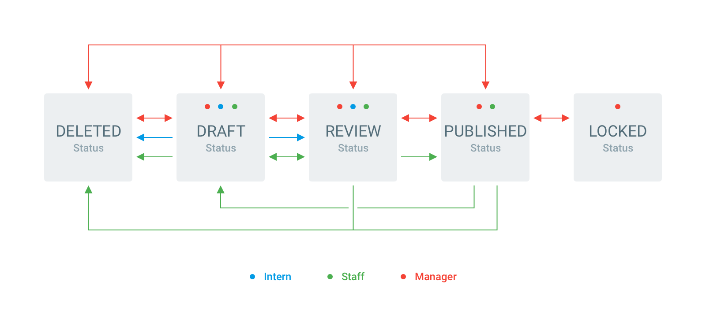

## Roles & Permissions

Directus permissions are extremely granular and powerful, but don't feel overwhelmed, you don't need to use or even understand the more advanced features to setup basic roles.

### Administrators

Users with this role have full permissions for all data within the system and are the only ones with access to Admin Settings. The administrator role is included by default and can not be edited or removed.

### Public

This special role defines what data is accessible _without_ being authenticated. The public role is included by default (with all permissions off) and can not be removed.

### Creating Roles

You can also create additional roles that limit access for specific purposes. As of now, users can only be assigned to a single role, but our system is architected in a way to allow for merging multiple roles in the future.

#### Inviting Users

TK

#### Description

This is for internal use only. It helps your administrators understand the purpose of each role.

#### IP Whitelist

A CSV of IP addresses that are allowed to connect to the APP/API. This can be used to limit access to specific offices, for example.

#### Navigation Override

A JSON object that allows for customizing the navigation sidebar. With the feature you can reorder collections, add links to specific items or external pages, and create new groupings. The default dynamic sections can still be included using the reserved `$collections`, `$extensions`, and `$bookmarks` values.

```json
{
    "Collections": {
        "Z. Collection Name": "/collections/collection-name",
        "X. Collection Name": "/collections/collection-name",
        "Y. Collection Name": "/collections/collection-name",
        "Specific Item Name": "/collections/collection-name/123",
        "External Link": "https://example.com"
    },
    "Another Group": {
        "A. Collection Name": "/collections/collection-name",
        "B. Collection Name": "/collections/collection-name",
        "C. Collection Name": "/collections/collection-name"
    },
    "Favorites": "$bookmarks",
    "Extensions": "$extensions"
}
```

### Permissions

Directus extends the typical CRUD access control to add even more granularity. For more information on how to set the base permissions (Create, Read, Update, Delete, Comment, and Explain) please read our dedicated Docs here.

::: tip
Use the "All/None" shortcut on hover of each row or click the column header to toggle that permission for all collections.
:::

#### Field Read/Write Blacklist

Clicking on the "Fields" button allows you to set blacklists for both read and write. This allows you to control which fields are visible or editable for the collection. All fields are readable and writable by default.

#### Status Blacklist

Clicking on the "Status" button allows you to set a blacklist of which status options. This allows you to control which status options a user can choose – for example, not allowing an Intern to _publish_ items. All statuses are available by default.

#### Workflow

Workflows are one of the most powerful features of Directus. They allow for all the other permission settings to be controled **per status**. This feature compounds the utility, but it can be difficult to fully understand its potential, so let's explore an example with all the bells and whistles:



##### Intern

* **Creating** – Can create Draft or Review items
* **Read** – Can see Draft items they created, Review items anyone in their role created, all Published items, and all Locked items
* **Update** – Can only update their Drafts. Can save their drafts to Review, but once submitted they can no longer be edited
* **Delete** – Can only delete their Drafts items
* **Explain** – Must leave an explanation when creating/updating Draft or Review items
* **Comment** – Can comment on their Draft items or Review items created by members of their role

##### Staff

* **Creating** – Can create Draft, Review, or Published items
* **Read** – Can see all Draft, Review, Published, and Locked items
* **Update** – Can update all Drafts, Review, and Published items. Published items can only be updated to Draft (not Review)
* **Delete** – Can only delete any Drafts or Review items, and can Delete their Published items
* **Explain** – Must leave an explanation when creating/updating Published items
* **Comment** – Can comment on any Draft, Review, or Published items

##### Manager

* **Creating** – Can create Draft, Review, Published, or Locked items
* **Read** – Can see all Draft, Review, Published, and Locked items
* **Update** – Can update all Drafts, Review, Published, and Locked items. Status can only be updated linearly
* **Delete** – Can delete any items except Locked
* **Explain** – Does not need to explain creations or updates
* **Comment** – Can comment on any item

#### Administrator

Not shown in the diagram, but worth noting: the Admin role always has _full_ permissions and is not required to explain anything.

#### Directus Collections

Below the permissions interface is a toggle to show the Directus system collections. These permissions are automatically generated when new roles are created and can be used to control system pages such as: File Library, User Directory, My Activity, etc.

::: warning
Changing the default system permissions can result in unexpected behavior or a completely broken platform. The API and App rely on certain data. For example, full read permission for `directus_users` is required. Only update these values if you know exactly what you're doing.
:::

### Deleting Roles

To delete a role: first remove all its users, then click the Delete button in the header of the Role Detail page.