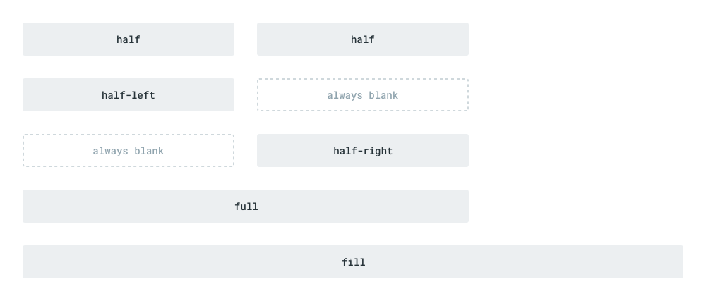

# Fields

> A Field is a specific type of value within a Collection. For example, you might have _Title_, _Body_, _Author_, and _Date Published_ fields within an _Articles_ collection. Each field represents a database column.

## Adding Fields

To get started, go to _Settings > Collections & Fields_, choose the Collection you want to add the field to, then click "New Field".

### 1. Choose an Interface

Do you want a Toggle? Text Input? Map? Dropdown? Relationship? There are many Core Interfaces available here, with even more Extension Interfaces available. This is always the first step when creating a new field, and dictates the rest of the process.

### 2. Set the Schema Options

Only the "Name" is required for this step, but it's good to familiarize yourself with the other options to get the most out of each field.

* **Name** — The database column name and API field key. Lowercase alphanumeric and underscores.
* **Display Name** — A formatted preview of how users will see the field name throughout the App.
* **Note** — Optional helper text shown beside the field on the Item Detail page.
* **Advanced Options**
  * **Directus Type** — Directus specific type that the interface supports (eg: `string`, `number`).
  * **Datatype** — Database-specific type to use (eg: `VARCHAR`, `INT`, etc).
  * **Length** — Max size of data that can be contained by this field.
  * **Default** — The default value for this field. Used for new items if the field is left blank.
  * **Validation** — A RegEx string used to validate the value on save. (eg: `/^[A-Z]+$/` allows only uppercase characters)
  * **Validation Message** — Custom validation message displayed if the above validation fails
  * **Required** — Whether or not this field requires a value.
  * **Readonly** — Whether or not this field's interface is interactive on the item detail page
  * **Unique** — Whether or not this field's value must be unique within the collection.
  * **Hidden Detail** — Hides the field on the Item Detail page.
  * **Hidden Browse** — Hides the field on the Item Browse page.
  * **Signed** — "Signed" is used to store negative values, "Unsigned" can only be positive.

### 3. Relationship Setup

This step only appears if you selected a relational interface, such as _Many to Many_ or _Translations_. If you're unfamiliar with relationships you can learn how to configure them in our [Relationships Guide](/guides/relationships.md).

### 4. Interface Options

Interfaces are highly customizable with options that allow you to tailor them to individual uses. These vary depending on interface complexity, with less-common options hidden within an "Advanced" accordion. In addition to an interface's custom options, _every_ field has a system option for its width. Learn more about this within the Field Layout section below.

## Field Layout

You can change the layout of fields on the Item Detail page to create tailored forms for each collection. Layout is configured through the following settings:

### Field Order

You can use the drag handles on the left of each field to update their order within Directus.

::: tip
Initially, Directus fields mirror the order of their respective database columns. However Directus allows you to manage column order and field order _separately_, since the specific order of columns in the database can be used to optimize query performance.
:::

### Field Width

You can also adjust the width of each field within the Directus Item Detail form. Certain width options wrap differently, so form placement may also be affected (in combination with the field's sort value). The width options are explained visually below.

## Deleting Fields

Clicking the "×" icon on the right side of the Fields interface will completely delete the field from the schema as well as all its Item data. You are prompted to confirm this action, however once the field delete is executed the change takes place immediately.

::: warning
It is possible to irreverisbly delete massive amounts of data with this feature. Proceed with extreme caution.
:::
