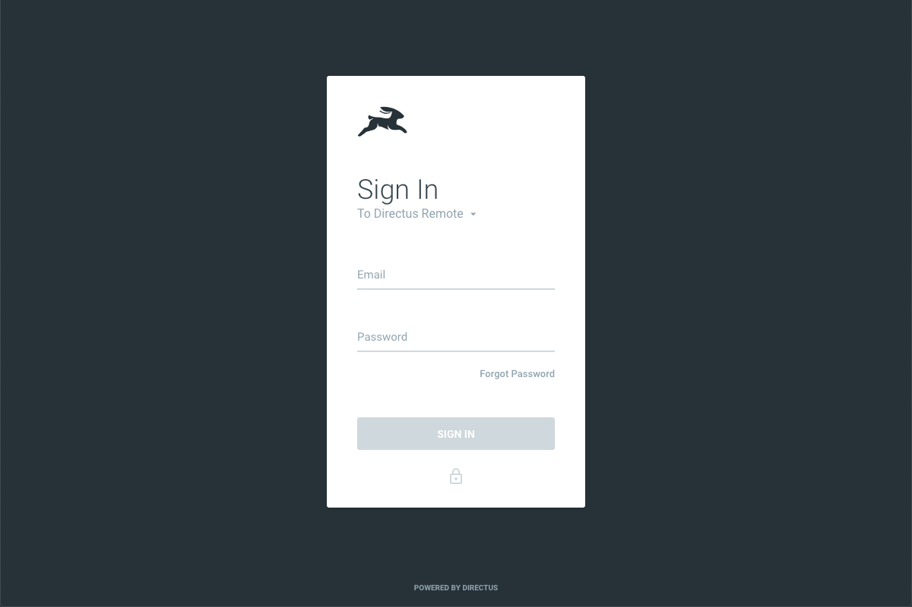
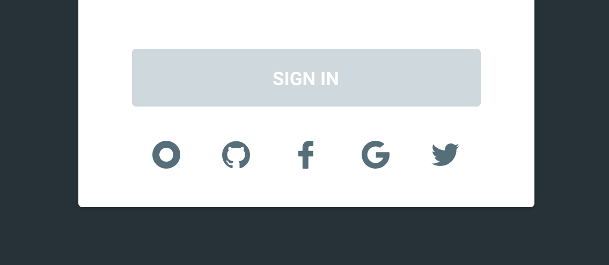
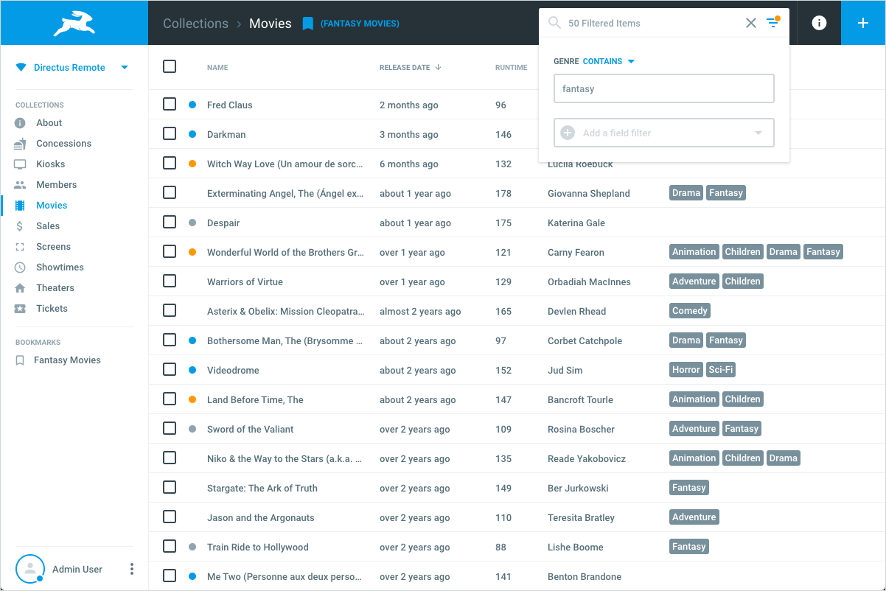
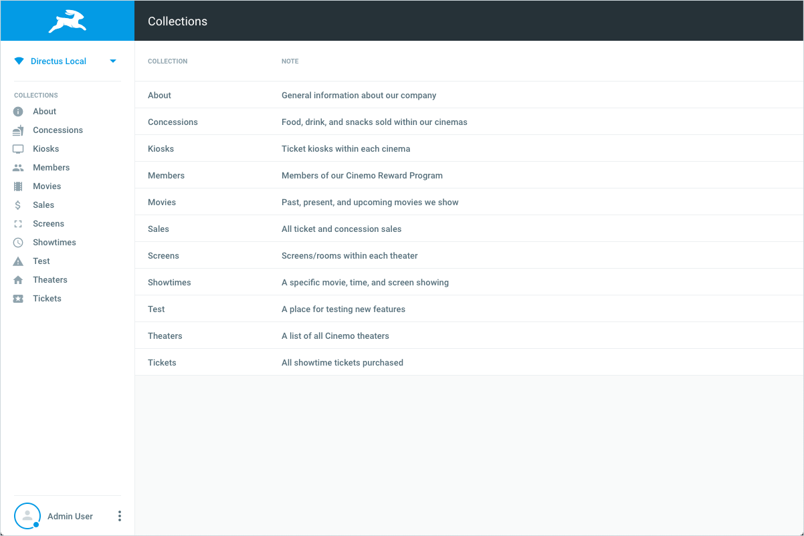
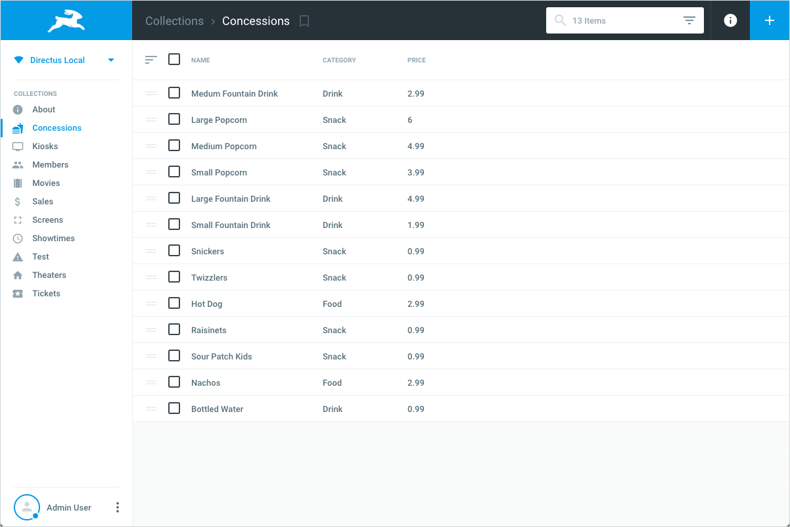
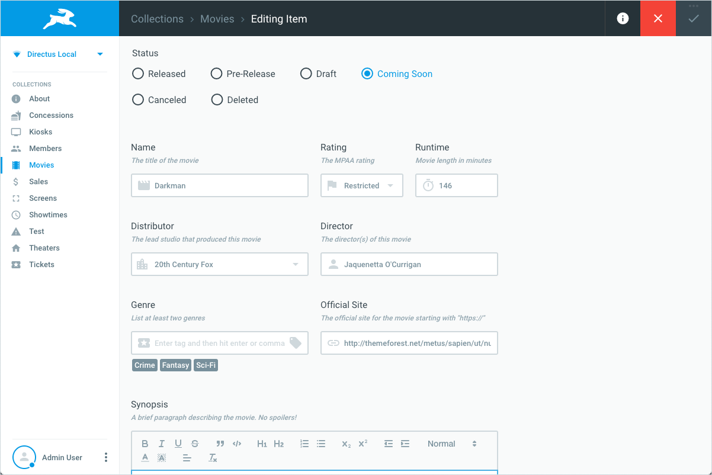
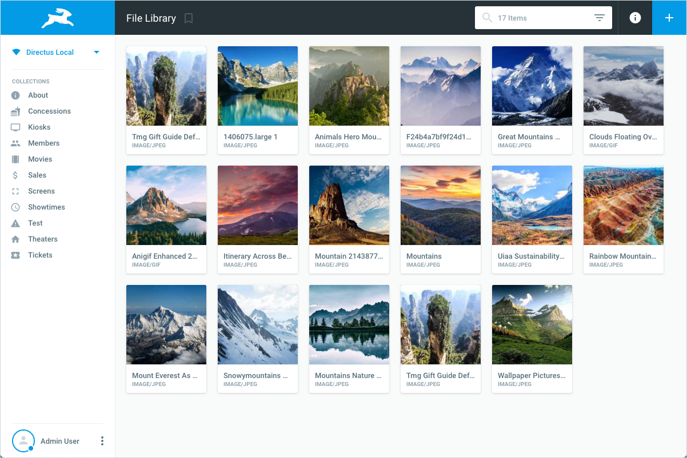
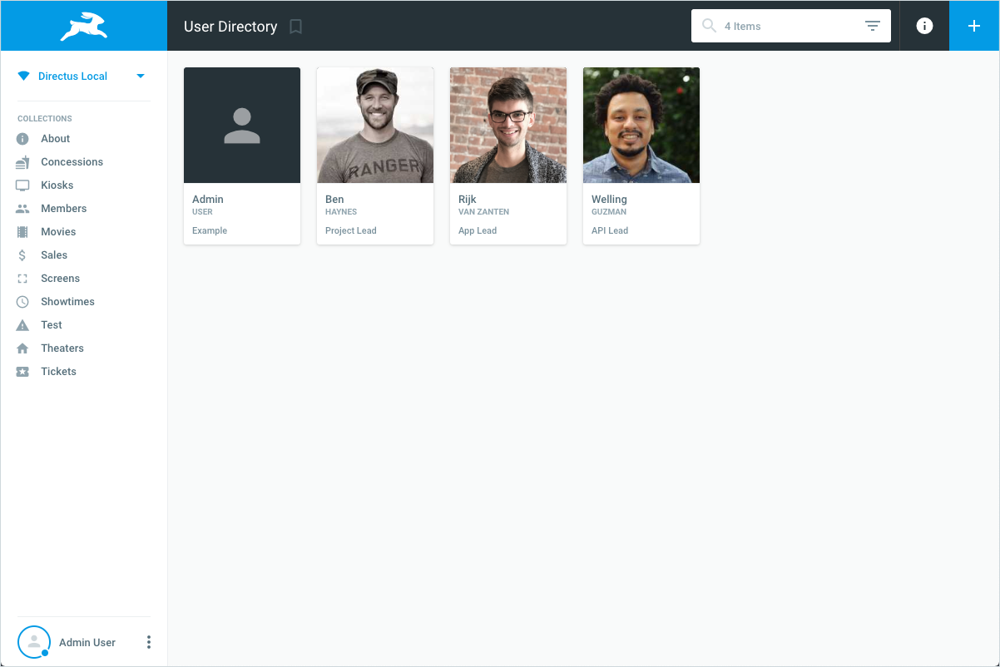
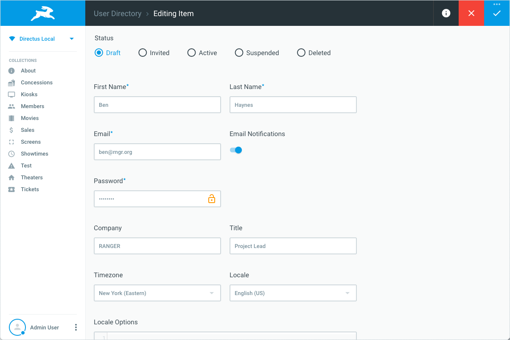
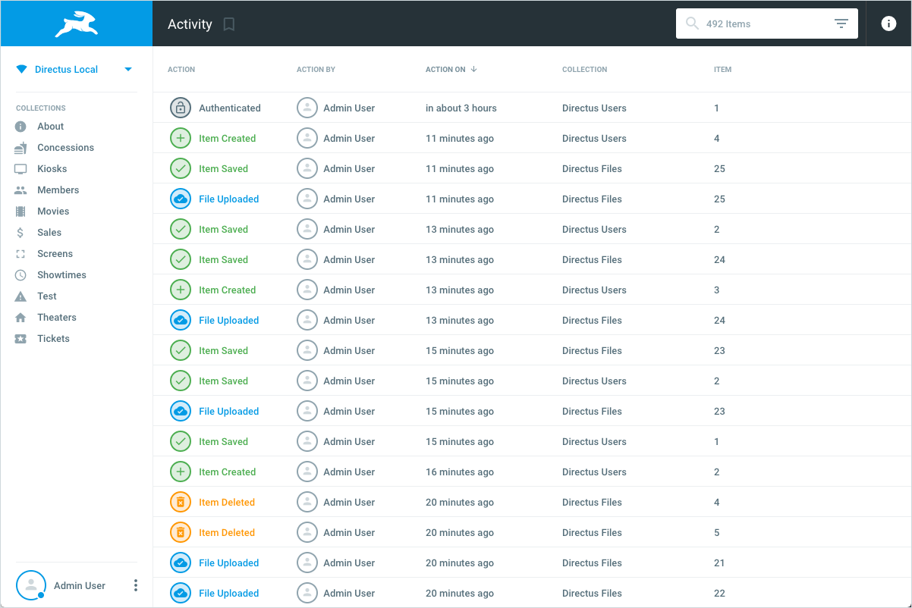

# App User Guide

> This guide is written for non-technical users just getting started with Directus — it does not cover setup or other Admin features. If you're completely new to the platform it is recommended that you read our [Introduction to Directus](../getting-started/introduction.html).

## Login

This is probably the first Directus page you'll see, so let's learn a bit more about what you can do here. First, Directus uses your email address instead of a username, so there's one less thing to forget. Simply enter your email address and type in your Directus user's password.

::: tip
You can see which version of the Directus App you're using by hovering over the "Powered by Directus" text at the bottom of the page.
:::

::: warning
Never share your password. Directus securely encrypts all passwords so there is no reason for anyone to ask you for it.
:::

### Changing Projects

If Directus has been configured to connect to multiple projects, then you'll see a dropdown on the login form. You can use this to select a specific project to log in to, or in some cases, to type/paste a project link.

::: tip
Remember, your account passwords may be different on separate projects, even if they use the same email address.
:::

### Single Sign-On

Next to the default secure login, Directus allows you to use several external services as means of authentication.

When [the system has been configured to allow you to login with external services](#), the logos of these services will show up on the login form.

Clicking one of these icons will take you to a secure login page of the service you chose. Directus will allow you to login with your external account as long as it uses the same email address as your Directus user account.

### Forgot password

Your password is securely encrypted, so no one can remind you what it is if forgotten. Instead, click on the "Forgot Password" link and enter the email address you use to log in. Directus will then send you an email with a temporary reset link; simply click on that link or paste it into your browser to reset your password.

## Overview

### Header

The header bar contains a breadcrumb highlighting where you currently are within the system and will provide you with a set of actions you can perform on the current page. Often these actions will be related to managing item(s), like saving, searching, deleting, or modifying the selection.

### Navigation Sidebar

The navigation sidebar contains links to your collections, bookmarks, and extensions. This sidebar is accessible from all pages in the system.

#### Logo & Loading Indicator

Everytime the application is working on something, such as saving or retrieving items, the logo in the top-left will transform into a loading indicator (by default, a running hare).

#### Project Switcher

To switch from the current project to another, click on the project name in the top left. This section also shows you the current connection status with the system. Hovering over the project switcher will show you the exact URL you're currently connected to and the latency (milliseconds of delay) to the server.

#### Collections

The first group of links shows all of the available collections.

#### Extensions

The second group of links shows any installed extensions. These pages provide extra functionality within the system.

::: tip
This menu won't show up if no extensions are installed.
:::

#### Bookmarks

The third group of links shows your bookmarks. To learn more about bookmarking pages, see [the bookmarking section](#bookmarking).

::: tip
Your system administrator has the ability to [override the links](#) in the navigation sidebar, so the way it appears and functions might differ in your application.
:::

#### User Menu

At the bottom of the navigation sidebar is your user's avatar and name. Hovering over this section reveals the user menu which contains links to system pages and a logout button.

* **Admin Settings** – Only available to members of the Administrator Role
* **Help & Docs** – An external link to these Directus Docs
* **File Library** – Navigates to the [File Library](#file-library)
* **User Directory** – Navigates to the [User Directory](#user-directory)
* **My Activity** – Navigates to the [Activity Page](#activity-page)
* **My Profile** – Navigates to your profile page, where you can update your user account
* **Sign Out** – Logs you out of Directus

### Info Sidebar

The info sidebar is hidden by default, but it appears when you click the "i" button in the header. It contains additional information and settings for the current page. When viewing items, for example, this sidebar allows you to configure the way your data is displayed.

### Page

The main section of the app contains the actual page's content.

## Collections

A "collection" is a _group_ or _category_ of items. This could be almost anything: articles, projects, customers, sales, reports, messages, etc. This page lists all of the collections you have access to.

## Items

This page displays the items within a collection. All the inforation you need might be displayed here, or you can use this page to find and manage specific items. This is one of the most powerful pages in Directus, with many different features available depending on the layout chosen.

### Layouts

The Items page will use the List layout by default, but depending on the collection content, you may want to view items as a grid of cards, on a map, in a calendar, or in other ways. You can change the layout from the top of the [Info sidebar](#info-sidebar).

### Layout Options

Each layout may have options for customizing its appearance. These can also be found in the [Info sidebar](#info-sidebar), just below the [Layout](#layouts) dropdown. For example, the default List layout lets you toggle/reorder field columns and change row spacing.

### Searching

You can easily search through items by entering a query into the search box in the header. This is a quick tool for finding specific items. When not in use, the search input displays the number of items displayed.

### Filtering

For more precise results, you can click on the filter icon on the right-side of the search input to expose the filter dropdown. Here you can add a single filter (eg: where _Publish Date_ is after today) or chain multiple filters together.

Each filter is composed of three parts: the field, the [operator](#), and the value. For example: _Date Published_ (field) greater than or equal to (`>=` operator) "April 20th, 2018" (value). The operator can be changed by clicking on it.

If any active filters are present, an _orange dot_ will be shown on top of the filter icon. Individual filters can be removed by hovering over it and clicking "Remove". All filters (and any Search query) can be cleared by clicking the "X" in the search box.

::: tip
Multiple filters are added together with "and" not "or". For example: _Name_ contains "Ben" **and** _Location_ is "Brooklyn" would only return results where both filters match.
:::

### Sorting

Certain layouts support sorting items. In the List view, clicking a column header sorts by that field A-Z, and clicking it again will reverse the sort to Z-A. Sorting items is a convenient way to browse items but does not change how they are displayed elsewhere.

### Reordering

Certain layouts support _manually_ changing the order of items. For example, on the List layout you can enable drag-and-drop reordering by clicking on the "sort" icon in the header (the left-most column). Once enabled, you can drag items to a new order using their handle. Reordering instantly updates the actual sort values for all items, so you should be careful using this feature.

::: tip
This feature is only available if your collection has a "sort" field.
:::

### Bookmarking

As you can see, there are many ways to fine-tune the way you view Items. Whenever you change one of the above options, Directus saves it to your user's preferences so it will look the same next time you view the page. If you would like to save _multiple_ different views, then you would use bookmarks.

You can create a bookmark by clicking the icon to the right of the breadcrumb in the [header](#header). Once clicked, you'll be prompted to enter a name for the bookmark, and then it will be added to your [Bookmarks](#bookmarks) list in the navigation sidebar for easy access.

To delete a bookmark, just hover over it in the Bookmarks list and click the delete icon on the right.

Here's what info is saved for each bookmark:

* Layout view (eg: List, Card, Map, Calendar)
* Layout options (eg: visible fields, field order, spacing)
* Sort Column & Direction (eg: Name Ascending, Date Published Descending)
* Search & Filters (eg: "Lorem" general search and _Price_ greater than 10)

::: tip
If you see bookmarks that you didn't create, don't worry. They are likely Role or Global bookmarks that your administrator added for convenience. Role and global bookmarks can not be deleted by users.
:::

### Creating Items

To add a new item to the collection, just click the New button ("+") in the header. This will open a blank [Item Detail](#item-detail) page for authoring content.

### Selecting & Opening Items

Certain layouts allow for selecting items. List view items can be selected by toggling the checkbox on the left-side of its row; you can select-all _visible_ items by clicking the checkbox in the column header (keyboard shortcut: ⌘A Mac, Ctrl+A Win). The Card view shows a selection toggle when you hover over each card.

Once one or more items are selected, a Delete button will appear in the header. Once two or more items are selected, a [Batch Edit](#batch-edit) button will appear in the header.

::: warning
It is possible to quickly and irreversibly delete many items on this page. Always perform batch deletes carefully!
:::

Alternatively, simply clicking on an item will take you to its [Item Detail](#item-detail) page.

## Item Detail

This page is used to view, create, edit, or delete a specific item based on your [role permissions](#). The main content of this page shows the interface for each available field. The [Info Sidebar](#info-sidebar) of this page is used for Item Activity and Comments.

### Saving

The Save button ("✓") is located on the far-right of the header and will be disabled until content is added or updated. Once enabled, clicking the button will save any changes and navigate back to the Items page. Additional save options are available by clicking the "•••" at the top of the button, including:

* **Save and Stay** – Saves the item but stays on the same page (keyboard shortcut: ⌘S Mac, Ctrl+S Win)
* **Save and Explain** – Prompts for an explanation of changes, attaching that message to the revision
* **Save and Add New** – Saves the item and then opens a blank Create Item page for that collection
* **Save as Copy** – Does not save the original item; instead all values and edits are saved as a new item

### Required Fields

Required fields display an accent `*` to the right of their label. These fields must be completed before saving is allowed.

### Validation

Fields may require their values to follow certain rules to be considered valid. If you attempt to save a field with an invalid value, you'll see a warning notification and the field label will become red.

### Special Fields

There are a few special fields that you may see on this page that deserve some extra attention. These include:

#### Primary Key

Often called `id`, this required field _cannot be changed_ after an item is created. It is a unique identifier used by Directus and your Project to track or reference the item.

#### Status

Often used to mark an item as "Draft", Under Review", or "Published", this optional field is completely customizable so your options may vary. The status of an item determines if it is accessible by your project (eg: _Published_) or not (eg: _Draft_).

When enabled, the status field is an important part of content Workflows. A Workflow is a set of rules that determine what can be edited, and by whom, at each "stage" of an item's life. For example, an Intern role may be able to create "Draft" items and submit them for review. A Manager role may see additional fields and have the ability to shift the item from "Under Review" to "Published." An Owner role may see all fields and have total control over status. Workflows are extremely powerful and can be linear, organic, or any hybrid in-between.

#### Files

There are several different interfaces that manage files in unique ways, but they all use the same global file uploader which we'll explain here.

* **Drag-and-Drop** – You can drag and drop files directly from your computer to the interface to start an upload
* **Select** – Clicking the icon in the top-right will let you manually select one or more files from your device
* **URL** – Clicking the icon in the top-right will let you type/paste a URL to a file or embed (eg: YouTube or Vimeo)

#### Translations

When managing multilingual content, you'll use this field interface to intuitively manage content in any number of languages. Your project will determine which languages are supported as well as the default. Simply select the language you wish to edit from the dropdown and update fields with the language placard beside their label. Translation updates are only saved when the parent item itself is saved.

::: tip
Notice that some fields may not require translating (eg: Publish Date); these are only entered once and will be located outside of the translations interface.
:::

### Deleting

The red Delete button ("×") is located in the header. Clicking this button will have you confirm that you want to irreversibly delete this item. Once deleted you will be returned to the Items page.

### Activity & Revisions

All changes made through Directus are tracked for accountability. That means that you can always go back and review the history of each item, from the most current edit back to its creation. Each revision expands when clicked and will show the specific updates made with the option to revert back to that version.

### Reverting

As described above, clicking a revision in the sidebar's Activity timeline will expose the specific updates (only the _edits_ made) and a "Revert" button. Clicking this button will open a _full_ preview of the item at that point in time. At the bottom of this preview is a button to perform the actual revert.

### Comments & Mentions

Also in the info sidebar, and comingled with the activity timeline, are any comments that users have left for this item. New comments can be added in the input at the top of the sidebar. Comments support basic [Markdown syntax](#) for formatting.

## File Library

The file library is an annex of all files added to Directus. Files may be added through item fields (eg: a slideshow interface) or directly to the File Library itself. To add a file directly to the library, drag a file directly onto the page or click the New button ("+") in the header. Directus automatically pulls in metadata from added files/embeds, such as: description, location, tags, and dimensions.

Directus also supports multiple [storage adapters](../extensions/storage-adapters.md), so you may have the option to save files to different locations.

There's also an automatic [thumbnailer](./thumbnailer.md) included, so you can easily save your original files at different sizes. Allowed thumbnail sizes are setup by your administrator.

By default the File Library displays as a Card layout with thumbnails, but you can change this in the [Info Sidebar](#info-sidebar).

## User Directory

The user directory is a single place to browse all Directus users. Clicking on a user here will open up their user profile page.

By default the File Library displays as a Card layout with images/avatars, but you can change this in the [Info Sidebar](#info-sidebar).

::: tip
Clicking on any user's name or avatar throughout the system will open a modal to quickly see their user profile.
:::

## My Account

This shortcut to your user's profile is where you can edit account information such as: email address, password, avatar, and more. Below we'll cover what each core field is for, but your specific user page might have additional fields added by your administrator.

* **First Name** – Your given name
* **Last Name** – Your surname name, which can be hyphenated
* **Email** – The email used to sign-in to Directus
* **Email Notifications** – If you want to Directus @mentions forwarded to your email
* **Password** – The password used to sign-in to Directus
* **Avatar** – An image that represents your user throughout Directus
* **Company** – The name of the company or organization you work for
* **Title** – Your title or position within the company or organization
* **Locale** – This determines your App's language and date/number formatting
* **Timezone** – This determines how times are presented to you

## My Activity

Every edit, creation, deletion, upload, comment, login, and error – all captured in one place. This timeline of activity allows you to go back in time to what you did and when.

## Limited Permissions

The features described above assume you have full permissions, however your user's role may have limited permissions. You may only see a subset of collections, fields, items or pages depending on the privileges you've been granted. Furthermore, access to items and fields may change based on Workflow, so it's possible that if you edit an item's status it may suddenly disappear or become read-only. This is all normal and is configured by your project's administrator.

Keep permissions in mind when discussing content or sending links to colleages, as they may not be able to see/edit the same items you have access to.

Only users with the Administrator role are guaranteed to see _everything_ in the system, including some special features only available to them. Learn more about the [Administrator Role](./roles.md).
